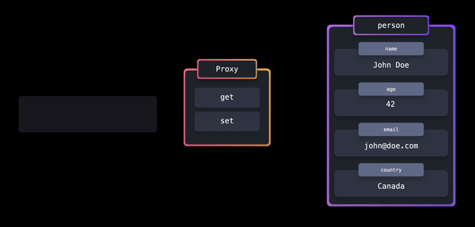
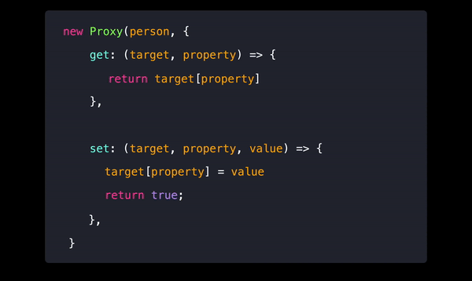

# Proxy

With a Proxy object, we get more `control` over the `interactions` with certain objects.

Normally, we access object properties and set them with `dot notation`. But without any validation or control. But Proxy is a middleware we can have and apply any functionality that is desired.



## Implementation

In JavaScript, we can easily create a new proxy by using the built-in `Proxy` object.


### The Proxy object receives two arguments:

1. The `target` object

2. A `handler` object, which we can use to add functionality to the proxy. This object comes with some built-in functions that we can use, such as get and set. <br /><br />

```js
const person = {
  name: "John Doe",
  age: 42,
  email: "john@doe.com",
  country: "Canada",
};

const personProxy = new Proxy(person, {
  get: (target, prop) => {
    console.log(`The value of ${prop} is ${target[prop]}`);
    return target[prop];
  },
  set: (target, prop, value) => {
    console.log(`Changed ${prop} from ${target[prop]} to ${value}`);
    target[prop] = value;
    return true;
  },
});
```

<mark>Note</mark>: We can use built-in `Reflect` object (it's an object containing all the needed methods for proxy handling) to make it `easier` to `manipulate` the target object.



## Tradeoffs

## Advantages


### 🟢 `Enhanced Security and Access Control` :

```js
// Define the user object representing user profile
const user = {
  name: "John",
  email: "john@example.com",
  role: "user",
  isAdmin: false,
};

// Define a handler for the Proxy to implement access control
const accessControlHandler = {
  get: function (target, property) {
    // Check if the property is sensitive and user is not an admin
    if (property === "email" && !target.isAdmin) {
      throw new Error(
        "Access denied: You do not have permission to access sensitive information"
      );
    } else {
      // Allow access to non-sensitive properties or if user is an admin
      return target[property];
    }
  },
  set: function (target, property, value) {
    // Check if user is an admin before allowing property modification
    if (!target.isAdmin) {
      throw new Error(
        "Access denied: You do not have permission to modify properties"
      );
    } else {
      // Allow modification if user is an admin
      target[property] = value;
      return true;
    }
  },
};

// Simulate a user with admin privileges
user.isAdmin = true;

// Create a Proxy with access control mechanisms
const securedUser = new Proxy(user, accessControlHandler);

// Attempt to access properties
console.log(securedUser.name); // Output: John (allowed)
console.log(securedUser.email); // Throws: Error: Access denied: You do not have permission to access sensitive information
console.log(securedUser.role); // Output: user (allowed)

// Attempt to modify properties
securedUser.name = "Jane"; // Throws: Error: Access denied: You do not have permission to modify properties
securedUser.email = "jane@example.com"; // Throws: Error: Access denied: You do not have permission to modify properties
securedUser.role = "admin"; // Throws: Error: Access denied: You do not have permission to modify properties
```

### 🟢 `Enhanced Security and Access Control` :

```js
// Define the user object
const user = {
  username: "john_doe",
  email: "john.doe@example.com",
  age: 25,
};

// Create a Proxy for the user object with data validation
const userProxy = new Proxy(user, {
  // Trap for setting properties
  set: (obj, prop, value) => {
    // Data validation based on the property being set
    if (prop === "username") {
      // Username must be alphanumeric with underscores
      if (!/^[a-zA-Z0-9_]+$/.test(value)) {
        throw new Error(
          "Username can only contain letters, numbers, and underscores."
        );
      }
    }

    if (prop === "email") {
      // Email must be in a valid format
      if (!/^[\w.-]+@[a-zA-Z]+\.[a-zA-Z]{2,}$/.test(value)) {
        throw new Error("Please provide a valid email address.");
      }
    }

    if (prop === "age") {
      // Age must be a positive integer
      if (!Number.isInteger(value) || value <= 0) {
        throw new Error("Age must be a positive integer.");
      }
    }

    // If data validation passes, allow the property to be set
    return Reflect.set(obj, prop, value);
  },
});

// Attempt to set properties with invalid values
try {
  userProxy.username = "john@doe"; // Throws an error
} catch (error) {
  console.error(error.message); // Output: Username can only contain letters, numbers, and underscores.
}

try {
  userProxy.email = "invalid.email"; // Throws an error
} catch (error) {
  console.error(error.message); // Output: Please provide a valid email address.
}

try {
  userProxy.age = -25; // Throws an error
} catch (error) {
  console.error(error.message); // Output: Age must be a positive integer.
}

// Log the user object after successful property assignments
console.log(userProxy);
```

### 🟢 `Caching and Optimization` :

```js
// Function to be cached (example: a costly computation)
function expensiveComputation(n) {
  console.log(`Performing expensive computation for ${n}`);
  return n * 2;
}

// Create a cache object
const cache = {};

// Create a Proxy to implement caching
const cachedExpensiveComputation = new Proxy(expensiveComputation, {
  apply: function (target, thisArg, args) {
    // Generate a unique key based on function name and arguments
    const cacheKey = `${target.name}_${args.join("_")}`;

    // Check if result exists in cache
    if (cache[cacheKey] !== undefined) {
      console.log(`Returning cached result for ${args}`);
      return cache[cacheKey];
    } else {
      // Call the original function and store result in cache
      const result = Reflect.apply(target, thisArg, args);
      console.log(`Caching result for ${args}`);
      cache[cacheKey] = result;
      return result;
    }
  },
});

// Test the cached function
console.log(cachedExpensiveComputation(5)); // Performs computation, caches result, returns 10
console.log(cachedExpensiveComputation(5)); // Returns cached result 10
console.log(cachedExpensiveComputation(10)); // Performs computation, caches result, returns 20
console.log(cachedExpensiveComputation(10)); // Returns cached result 20
```

### 🟢 `Lazy Loading and Performance Optimization` :

```js
// Simulated asynchronous function to fetch resource data
function fetchResource(resourceName) {
  console.log(`Fetching ${resourceName}...`);
  // Simulate a delay in fetching the resource
  return new Promise((resolve) => {
    setTimeout(() => {
      resolve(`Data for ${resourceName}`);
    }, 1000); // Simulate 1 second delay
  });
}

// Create a Proxy for lazy loading resources
const lazyLoadedResources = new Proxy(
  {},
  {
    get: function (target, resourceName) {
      // Check if resource is already loaded
      if (!target[resourceName]) {
        // If resource is not loaded, fetch it and store the promise in the target
        target[resourceName] = fetchResource(resourceName);
      }
      // Return the promise for the resource
      return target[resourceName];
    },
  }
);

// Access resources lazily
lazyLoadedResources.resource1.then((data) => {
  console.log("Resource 1:", data);
});

lazyLoadedResources.resource2.then((data) => {
  console.log("Resource 2:", data);
});

// Output:
// Fetching resource1...
// Fetching resource2...
// (After 1 second)
// Resource 1: Data for resource1
// Resource 2: Data for resource2
```

## Disadvantages

### 🔴 `Performance Overhead`:

Using proxies can introduce a `slight performance overhead` due to the `interception of property access and modification`. While this overhead is usually negligible, it can be a concern in highly performance-critical applications.


### 🔴 `Debugging Challenges`:

Debugging code that `heavily` relies on proxies can be more challenging, as the behavior of proxies can add an additional layer of complexity to the debugging process.

### 🔴 `Overuse and Over-engineering`:

It’s important to use proxies `judiciously`. Overusing proxies or implementing them for simple tasks that can be accomplished with traditional methods may lead to over-engineering and unnecessarily complex code.
