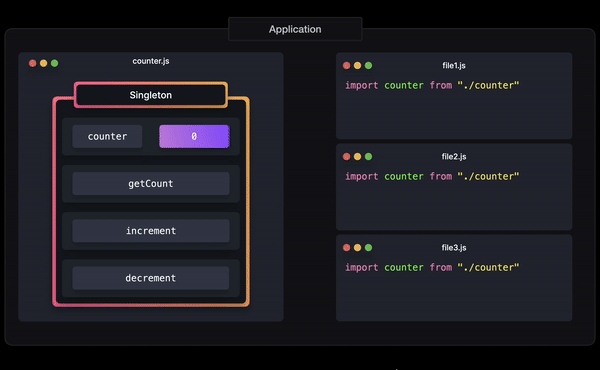

# Singleton

The singleton pattern is a design pattern that ensures that a class can only have `one instance` of itself. <br />
This single instance can be shared throughout our application, which makes Singletons great for `managing global state` in an application.

## Implementation

```js
let instance;
let counter = 0;

// 1. Creating the `Counter` class, which contains a `constructor`, `getInstance`, `getCount`, `increment` and `decrement` method.

class Counter {
  constructor() {
    if (instance) {
      throw new Error("You can only create one instance!");
    }
    this.counter = counter;
    instance = this;
  }

  getCount() {
    return this.counter;
  }

  increment() {
    return ++this.counter;
  }

  decrement() {
    return --this.counter;
  }
}

// 2. Setting a variable equal to the the frozen newly instantiated object, by using the built-in `Object.freeze` method.
// This ensures that the newly created instance is not modifiable.
const singletonCounter = Object.freeze(new Counter());

// 3. Exporting the variable as the `default` value within the file to make it globally accessible.
export default singletonCounter;
```



<mark>Note</mark> : We can also implement it with `Objects`:

```js
let counter = 0;

export default Object.freeze({
  getCount: () => counter,
  increment: () => ++counter,
  decrement: () => --counter,
});
```

### Tradeoffs

🟢 `Memory` : Restricting the instantiation to just one instance could potentially `save a lot of memory space`. Instead of having to set up memory for a new instance each time, we only have to set up memory for that one instance, which is referenced throughout the application.

🔴 `Unnecessary` : ES6 modules are singleton by default. We no longer need to explicitly create singletons to achieve this global, non-modifiable behavior.

🔴 `Global Scope Pollution` : The global behavior of Singletons is essentially the same as a global variable. Global Scope Pollution can end up in `accidentally overwriting` the value of a global variable, which can lead to a lot of `unexpected behavior`.
