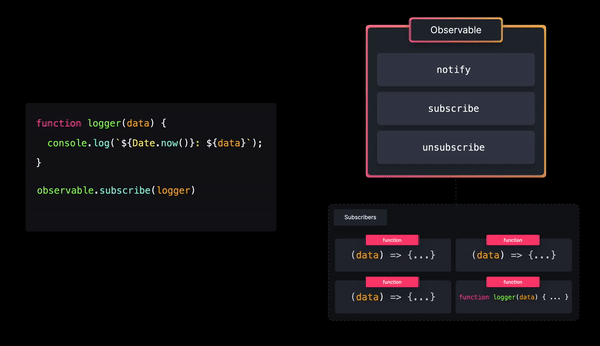

# Observer Pattern

With the `observer pattern`, we can subscribe certain objects (called `observers`) to another object (called the `observable`). Whenever an `event` occurs, the observable `notifies all its observers`!



An observable object usually contains 4 important parts:

- `observers`: an `array of observers` that will get notified whenever a specific `event occurs`
- `subscribe()`: a method in order to `add observers to the observers list`
- `unsubscribe()`: a method in order to `remove observers from the observers list`
- `notify()`: a method to `notify all observers whenever a specific event occurs`

## Implementation

#### **analytics-observer.js**

```js
const observers = [];

const Observable = {
  subscribe: (func) => observers.push(func),
  unSubscribe: (func) => observers.filter(f !== func),
  // Here we use foreach to mutate the original observers array
  notify: (data) => observers.foreach((observer) => observer(data)),
};

export default Observable;
```

#### **analytics.js**

```js
import Observable from './analytics-observer.js';

export function sendToGoogleAnalytics(data) {
  console.log('Sent to Google analytics: ', data);
}

export function sendToCustomAnalytics(data) {
  console.log('Sent to custom analytics: ', data);
}

export function sendToEmail(data) {
  console.log('Sent to email: ', data);
}

// We subscribe all the functions we want to broadcast to listeners

Observable.subscribe(sendToGoogleAnalytics);
Observable.subscribe(sendToCustomAnalytics);
Observable.subscribe(sendToEmail);

```

#### **index.js**

```js
import './style.css';
import {
  sendToGoogleAnalytics,
  sendToCustomAnalytics,
  sendToEmail,
} from './analytics.js';
import Observable from './analytics-observer';

const pinkBtn = document.getElementById('pink-btn');
const blueBtn = document.getElementById('blue-btn');

pinkBtn.addEventListener('click', () => {
  const data = '🎀 Click on pink button! 🎀';
  // Here we notify all our subscribers with the functions we want
  Observable.notify(data);
});

blueBtn.addEventListener('click', () => {
  const data = '🦋 Click on blue button! 🦋';
    // Here we notify all our subscribers with the functions we want
  Observable.notify(data);
});
```

### Tradeoffs

🟢 `Separation of Concerns`: The observer objects `aren't tightly coupled to the observable object`, and can be (de)coupled at any time. The observable object is responsible for monitoring the events, while the observers simply handle the received data. 

🔴 `Decreased performance`: Notifying all subscribers `might take a significant amount of time` if the observer handling becomes too complex, or if `there are too many subscribers to notify`.

