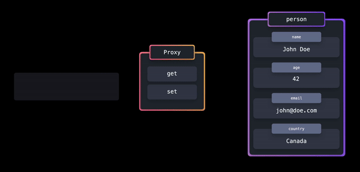

# Design Patterns

Design patterns are `concepts(solutions)` we can use to solve `commonly recurring issues` in software architecture.

# Best Practices

Best Practices are a set of `guidelines` or `recommendations (tips and tricks)` that are considered ideal or optimal in software development.

### **FYI: In this learning we want to learn about the `design patterns`**

# Module pattern

As your application and codebase grow, it becomes increasingly important to keep your code `maintainable` and `separated`.<br/>
The module pattern allows you to split up your code into `smaller` and `reusable` pieces.

ES2015 introduced built-in JavaScript modules. A module is a file containing JavaScript code and makes it easy to `expose (export)` and `hide (encapsulate)` certain values.

The module pattern provides a way to have both `public` and `private` pieces with the `export` keyword. This protects values from leaking into the global scope or ending up in a naming collision.

## Implementation

There a few ways we can use modules:

### HTML tag

When adding JavaScript to HTML files directly, you can use modules by adding the `type="module"` attribute to the script tags.

#### **index.html**

```html
<html>
  <head>
    <meta charset="UTF-8" />
    <script src="index.js" type="module"></script>
    <link href="./styles.css" rel="stylesheet" />
  </head>
</html>
```

#### **math.js**

```js
const secret = "This is just in this file and encapsulated";

export function sum(x, y) {
  return x + y;
}

export function multiply(x, y) {
  return x * y;
}

export function subtract(x, y) {
  return x - y;
}

export function divide(x, y) {
  return x / y;
}
```

#### **index.js**

```js
import { sum, subtract, divide, multiply, secret } from "./math.js";

console.log("Sum", sum(1, 2)); // 3
console.log("Subtract", subtract(1, 2)); // -1
console.log("Divide", divide(1, 2)); // 0.5
console.log("Multiply", multiply(1, 2)); // 2
console.log("Sum", secret); // Error in SyntaxError: The requested module '/math.js' does not provide an export named 'secret'
```

### Node

In Node, you can use ES6 modules either by:

- Using the `.mjs` extension
- Adding `"type": "module"` to your `package.json`

#### **package.json**

```json
{
  "name": "node-starter",
  "version": "0.0.0",
  "type": "module"
}
```

## Rename imports

In some cases, we need to use a name other than the function name itself. This is how we do it:

```js
import {
  add as addValues, // rename add to addValues
  multiply as multiplyValues, // rename multiply to multiplyValues
  subtract,
  square,
} from "./math.js";
```

## Default imports VS. Named imports

Besides named exports, which are exports defined with just the `export` keyword, you can also use a default export. You can `only have one` default export per module.

#### **math.js**

```js
// default export
export default function add(x, y) {
  return x + y;
}

export function multiply(x) {
  return x * 2;
}

export function subtract(x, y) {
  return x - y;
}

export function square(x) {
  return x * x;
}
```

Previously, we had to use the brackets for our named exports: `import { module } from 'module'`. With a default export, we can import the value without the brackets: `import module from 'module'`:

#### **index.js**

```js
import add, { multiply, subtract, square } from "./math.js";
```

Since JavaScript knows that this value is always the value that was exported by default, we can give the imported default value another name than the name we exported it with:

#### **index.js**

```js
import addValues, { multiply, subtract, square } from "./math.js";
```

## Import all

We can also import all exports from a module, meaning all named exports and the default export, by using an asterisk `*` and giving the name we want to import the module as. The value of the import is equal to an `object containing all the imported values`. Say that I want to import the entire module as `math`.

#### **math.js**

```js
import * as math from "./math.js";

math.default(7, 8); // this is the add function cause it's exported as the default
math.multiply(8, 9);
math.subtract(10, 3);
math.square(3);
```

In this case, we’re importing all exports from a module. Be careful when doing this, since you may end up `unnecessarily` importing values.

### Tradeoffs

🟢 `Encapsulation` : The values within a module are scoped to that specific module. Values that aren't explicitly exported are not available outside of the module.

🟢 `Reusability` : We can reuse modules throughout our application

## Dynamic import

When importing all modules on the top of a file, all modules get loaded before the rest of the file. In some cases, we only need to import a module based on a certain condition. With a `dynamic import`, we can import modules `on demand`:

```js
import("module").then((module) => {
  module.default();
  module.namedExport();
});

// Or with async/await
(async () => {
  const module = await import("module");
  module.default();
  module.namedExport();
})();
```

Let’s dynamically import the `math.js` example used in the previous paragraphs.<br/>
The module only gets loaded, if the user clicks on the button.

```js
const button = document.getElementById("btn");
const anotherButton = document.getElementById("anotherBtn");

button.addEventListener("click", () => {
  import("./math.js").then((module) => {
    console.log("Add: ", module.add(1, 2));
    console.log("Multiply: ", module.multiply(3, 2));
    button.innerHTML = "Check the console";
  });
});

/*************************** */
/**** Or with async/await ****/
/*************************** */
anotherButton.addEventListener("click", async () => {
  const { add, multiply } = await import("./math.js");
  console.log("Add: ", add(1, 2));
  console.log("Multiply: ", multiply(3, 2));
});
```

By dynamically importing modules, we can `reduce the page load time`. We only have to load, parse, and compile the code that the user really needs, `when the user needs it`.

# Singleton

The singleton pattern is a design pattern that ensures that a class can only have `one instance` of itself. <br />
This single instance can be shared throughout our application, which makes Singletons great for `managing global state` in an application.

## Implementation

```js
let instance;
let counter = 0;

// 1. Creating the `Counter` class, which contains a `constructor`, `getInstance`, `getCount`, `increment` and `decrement` method.

class Counter {
  constructor() {
    if (instance) {
      throw new Error("You can only create one instance!");
    }
    this.counter = counter;
    instance = this;
  }

  getCount() {
    return this.counter;
  }

  increment() {
    return ++this.counter;
  }

  decrement() {
    return --this.counter;
  }
}

// 2. Setting a variable equal to the the frozen newly instantiated object, by using the built-in `Object.freeze` method.
// This ensures that the newly created instance is not modifiable.
const singletonCounter = Object.freeze(new Counter());

// 3. Exporting the variable as the `default` value within the file to make it globally accessible.
export default singletonCounter;
```


<mark>Note</mark> : We can also implement it with `Objects`:

```js
let counter = 0;

export default Object.freeze({
  getCount: () => counter,
  increment: () => ++counter,
  decrement: () => --counter,
});
```

### Tradeoffs

🟢 `Memory` : Restricting the instantiation to just one instance could potentially `save a lot of memory space`. Instead of having to set up memory for a new instance each time, we only have to set up memory for that one instance, which is referenced throughout the application.

🔴 `Unnecessary` : ES6 modules are singleton by default. We no longer need to explicitly create singletons to achieve this global, non-modifiable behavior.

🔴 `Global Scope Pollution` : The global behavior of Singletons is essentially the same as a global variable. Global Scope Pollution can end up in `accidentally overwriting` the value of a global variable, which can lead to a lot of `unexpected behavior`.

# Proxy

With a Proxy object, we get more `control` over the `interactions` with certain objects.

Normally, we access object properties and set them with `dot notation`. But without any validation or control. But Proxy is a middleware we can have and apply any functionality that is desired.



## Implementation

In JavaScript, we can easily create a new proxy by using the built-in `Proxy` object.


### The Proxy object receives two arguments:

1. The `target` object

2. A `handler` object, which we can use to add functionality to the proxy. This object comes with some built-in functions that we can use, such as get and set. <br /><br />

```js
const person = {
  name: "John Doe",
  age: 42,
  email: "john@doe.com",
  country: "Canada",
};

const personProxy = new Proxy(person, {
  get: (target, prop) => {
    console.log(`The value of ${prop} is ${target[prop]}`);
    return target[prop];
  },
  set: (target, prop, value) => {
    console.log(`Changed ${prop} from ${target[prop]} to ${value}`);
    target[prop] = value;
    return true;
  },
});
```

<mark>Note</mark>: We can use built-in `Reflect` object (it's an object containing all the needed methods for proxy handling) to make it `easier` to `manipulate` the target object.


## Tradeoffs

## Advantages


### 🟢 `Enhanced Security and Access Control` :

```js
// Define the user object representing user profile
const user = {
  name: "John",
  email: "john@example.com",
  role: "user",
  isAdmin: false,
};

// Define a handler for the Proxy to implement access control
const accessControlHandler = {
  get: function (target, property) {
    // Check if the property is sensitive and user is not an admin
    if (property === "email" && !target.isAdmin) {
      throw new Error(
        "Access denied: You do not have permission to access sensitive information"
      );
    } else {
      // Allow access to non-sensitive properties or if user is an admin
      return target[property];
    }
  },
  set: function (target, property, value) {
    // Check if user is an admin before allowing property modification
    if (!target.isAdmin) {
      throw new Error(
        "Access denied: You do not have permission to modify properties"
      );
    } else {
      // Allow modification if user is an admin
      target[property] = value;
      return true;
    }
  },
};

// Simulate a user with admin privileges
user.isAdmin = true;

// Create a Proxy with access control mechanisms
const securedUser = new Proxy(user, accessControlHandler);

// Attempt to access properties
console.log(securedUser.name); // Output: John (allowed)
console.log(securedUser.email); // Throws: Error: Access denied: You do not have permission to access sensitive information
console.log(securedUser.role); // Output: user (allowed)

user.isAdmin = false;
const regularUser = new Proxy(user, accessControlHandler);

// Attempt to modify properties
regularUser.name = "Jane"; // Throws: Error: Access denied: You do not have permission to modify properties
regularUser.email = "jane@example.com"; // Throws: Error: Access denied: You do not have permission to modify properties
regularUser.role = "admin"; // Throws: Error: Access denied: You do not have permission to modify properties
```

### 🟢 `Data Validation` :

```js
// Define the user object
const user = {
  username: "john_doe",
  email: "john.doe@example.com",
  age: 25,
};

// Create a Proxy for the user object with data validation
const userProxy = new Proxy(user, {
  // Trap for setting properties
  set: (obj, prop, value) => {
    // Data validation based on the property being set
    if (prop === "username") {
      // Username must be alphanumeric with underscores
      if (!/^[a-zA-Z0-9_]+$/.test(value)) {
        throw new Error(
          "Username can only contain letters, numbers, and underscores."
        );
      }
    }

    if (prop === "email") {
      // Email must be in a valid format
      if (!/^[\w.-]+@[a-zA-Z]+\.[a-zA-Z]{2,}$/.test(value)) {
        throw new Error("Please provide a valid email address.");
      }
    }

    if (prop === "age") {
      // Age must be a positive integer
      if (!Number.isInteger(value) || value <= 0) {
        throw new Error("Age must be a positive integer.");
      }
    }

    // If data validation passes, allow the property to be set
    return Reflect.set(obj, prop, value);
  },
});

// Attempt to set properties with invalid values
try {
  userProxy.username = "john@doe"; // Throws an error
} catch (error) {
  console.error(error.message); // Output: Username can only contain letters, numbers, and underscores.
}

try {
  userProxy.email = "invalid.email"; // Throws an error
} catch (error) {
  console.error(error.message); // Output: Please provide a valid email address.
}

try {
  userProxy.age = -25; // Throws an error
} catch (error) {
  console.error(error.message); // Output: Age must be a positive integer.
}

// Log the user object after successful property assignments
console.log(userProxy);
```

### 🟢 `Caching and Optimization` :

```js
// Function to be cached (example: a costly computation)
function expensiveComputation(n) {
  console.log(`Performing expensive computation for ${n}`);
  return n * 2;
}

// Create a cache object
const cache = {};

// Create a Proxy to implement caching
const cachedExpensiveComputation = new Proxy(expensiveComputation, {
  apply: function (target, thisArg, args) {
    // Generate a unique key based on function name and arguments
    const cacheKey = `${target.name}_${args.join("_")}`;

    // Check if result exists in cache
    if (cache[cacheKey] !== undefined) {
      console.log(`Returning cached result for ${args}`);
      return cache[cacheKey];
    } else {
      // Call the original function and store result in cache
      const result = Reflect.apply(target, thisArg, args);
      console.log(`Caching result for ${args}`);
      cache[cacheKey] = result;
      return result;
    }
  },
});

// Test the cached function
console.log(cachedExpensiveComputation(5)); // Performs computation, caches result, returns 10
console.log(cachedExpensiveComputation(5)); // Returns cached result 10
console.log(cachedExpensiveComputation(10)); // Performs computation, caches result, returns 20
console.log(cachedExpensiveComputation(10)); // Returns cached result 20
```

### 🟢 `Lazy Loading and Performance Optimization` :

```js
// Simulated asynchronous function to fetch resource data
function fetchResource(resourceName) {
  console.log(`Fetching ${resourceName}...`);
  // Simulate a delay in fetching the resource
  return new Promise((resolve) => {
    setTimeout(() => {
      resolve(`Data for ${resourceName}`);
    }, 1000); // Simulate 1 second delay
  });
}

// Create a Proxy for lazy loading resources
const lazyLoadedResources = new Proxy(
  {},
  {
    get: function (target, resourceName) {
      // Check if resource is already loaded
      if (!target[resourceName]) {
        // If resource is not loaded, fetch it and store the promise in the target
        target[resourceName] = fetchResource(resourceName);
      }
      // Return the promise for the resource
      return target[resourceName];
    },
  }
);

// Access resources lazily
lazyLoadedResources.resource1.then((data) => {
  console.log("Resource 1:", data);
});

lazyLoadedResources.resource2.then((data) => {
  console.log("Resource 2:", data);
});

// Output:
// Fetching resource1...
// Fetching resource2...
// (After 1 second)
// Resource 1: Data for resource1
// Resource 2: Data for resource2
```

## Disadvantages

### 🔴 `Performance Overhead`:

Using proxies can introduce a `slight performance overhead` due to the `interception of property access and modification`. While this overhead is usually negligible, it can be a concern in highly performance-critical applications.

### 🔴 `Debugging Challenges`:

Debugging code that `heavily` relies on proxies can be more challenging, as the behavior of proxies can add an additional layer of complexity to the debugging process.

### 🔴 `Overuse and Over-engineering`:

It’s important to use proxies `judiciously`. Overusing proxies or implementing them for simple tasks that can be accomplished with traditional methods may lead to over-engineering and unnecessarily complex code.

# Observer Pattern

With the `observer pattern`, we can subscribe certain objects (called `observers`) to another object (called the `observable`). Whenever an `event` occurs, the observable `notifies all its observers`!


An observable object usually contains 4 important parts:

- `observers`: an `array of observers` that will get notified whenever a specific `event occurs`
- `subscribe()`: a method in order to `add observers to the observers list`
- `unsubscribe()`: a method in order to `remove observers from the observers list`
- `notify()`: a method to `notify all observers whenever a specific event occurs`

## Implementation

#### **analytics-observer.js**

```js
const observers = [];

const Observable = {
  subscribe: (func) => observers.push(func),
  unSubscribe: (func) => observers.filter(f !== func),
  // Here we use foreach to mutate the original observers array
  notify: (data) => observers.foreach((observer) => observer(data)),
};

export default Observable;
```

#### **analytics.js**

```js
import Observable from "./analytics-observer.js";

export function sendToGoogleAnalytics(data) {
  console.log("Sent to Google analytics: ", data);
}

export function sendToCustomAnalytics(data) {
  console.log("Sent to custom analytics: ", data);
}

export function sendToEmail(data) {
  console.log("Sent to email: ", data);
}

// We subscribe all the functions we want to broadcast to listeners

Observable.subscribe(sendToGoogleAnalytics);
Observable.subscribe(sendToCustomAnalytics);
Observable.subscribe(sendToEmail);
```

#### **index.js**

```js
import "./style.css";
import {
  sendToGoogleAnalytics,
  sendToCustomAnalytics,
  sendToEmail,
} from "./analytics.js";
import Observable from "./analytics-observer";

const pinkBtn = document.getElementById("pink-btn");
const blueBtn = document.getElementById("blue-btn");

pinkBtn.addEventListener("click", () => {
  const data = "🎀 Click on pink button! 🎀";
  // Here we notify all our subscribers with the functions we want
  Observable.notify(data);
});

blueBtn.addEventListener("click", () => {
  const data = "🦋 Click on blue button! 🦋";
  // Here we notify all our subscribers with the functions we want
  Observable.notify(data);
});
```

### Tradeoffs

🟢 `Separation of Concerns`: The observer objects `aren't tightly coupled to the observable object`, and can be (de)coupled at any time. The observable object is responsible for monitoring the events, while the observers simply handle the received data.

🔴 `Decreased performance`: Notifying all subscribers `might take a significant amount of time` if the observer handling becomes too complex, or if `there are too many subscribers to notify`.

# Factory Pattern

With the factory pattern we can use factory functions in order to `create new object`s. A function is a factory function when it `returns a new object without the use of the new keyword`!

## Implementation


## Tradeoffs

🟢 `DRY` : The factory pattern is useful when we have to `create multiple objects that share the same properties`, without having to repeat the same code over and over. A factory function can easily return a custom object depending on the current environment, or user-specific configuration.

🔴 `Not really a pattern!` : In JavaScript, the factory pattern isn't much more than a function that returns an object without using the new keyword. ES6 `arrow functions` allow us to create small factory functions that implicitly return an object each time.

# Prototype Pattern

The prototype pattern is a useful way to `share properties among many objects of the same type`. The prototype is an object that’s native to JavaScript, and can be accessed by objects through the prototype chain.

## Implementation

With [`factory pattern`](https://github.com/sob-hon/Today-I-Learned/blob/main/JavaScript-Design-Patterns/factory.md), when we wanted to create many dogs it was like this:

```js
const createDog = (name, age) => ({
  name,
  age,
  bark() {
    console.log(`${name} is barking!`);
  },
  wagTail() {
    console.log(`${name} is wagging their tail!`);
  },
});

const dog1 = createDog("Max", 4);
const dog2 = createDog("Sam", 2);
const dog3 = createDog("Joy", 6);
const dog4 = createDog("Spot", 8);
```

To show actually what happens, let's see the created objects:


Under the hood, we're creating two new functions for `each dog` object, which `uses memory`.

We can use the `Prototype Pattern` to share these methods among many dog objects.

```js
class Dog {
  constructor(name, age) {
    this.name = name;
    this.age = age;
  }

  bark() {
    console.log(`${this.name} is barking!`);
  }
  wagTail() {
    console.log(`${this.name} is wagging their tail!`);
  }
}

const dog1 = new Dog("Max", 4);
const dog2 = new Dog("Sam", 2);
const dog3 = new Dog("Joy", 6);
const dog4 = new Dog("Spot", 8);
```

As you see now we use `'Prototype Chain'` to access the `bark` and `wagTail` methods.


## \_\_proto\_\_

The prototype pattern is very powerful when working with objects that should have access to the same properties. Instead of creating a duplicate of the property each time, we can simply add the property to the `prototype`, since all instances have access to the `prototype object`.

Since all instances have access to the prototype, it’s easy to add properties to the prototype `even after creating the instances`.

```js
class Dog {
  constructor(name) {
    this.name = name;
  }

  bark() {
    return `Woof!`;
  }
}

const dog1 = new Dog("Daisy");
const dog2 = new Dog("Max");
const dog3 = new Dog("Spot");

Dog.prototype.play = () => console.log("Playing now!");

dog1.play(); // Playing now!
```

The term `prototype chain` indicates that there could be `more than one` step. Indeed! So far, we’ve only seen how we can access properties that are directly available on the first object that \_\_proto\_\_ has a reference to. However, `prototypes themselves also have a __proto__ object!`:

```js
class Dog {
  constructor(name) {
    this.name = name;
  }
  bark() {
    console.log("Woof!");
  }
}

/* 
When we use extends, it must call super() in its constructor. 
And also it points out our new instance's __proto__ to superclass (Dog in this case). 
*/
class SuperDog extends Dog {
  constructor(name) {
    /* 
    The super(name) statement is used to call the constructor of the superclass (Dog in this case)
    and pass the name parameter to it. This ensures that the name property of the Dog superclass is initialized correctly.
    */
    super(name);
  }

  fly() {
    console.log("Flying!");
  }
}

const dog1 = new SuperDog("Daisy");
dog1.bark(); // Woof!
dog1.fly(); // Flying!
```

We have access to the `bark` method, as we extended the `Dog` class. The value of `__proto__` on the prototype of `SuperDog` points to the `Dog.prototype` object!


<mark>Note</mark>: It gets clear why it’s called a prototype chain: when we try to access a property that’s not directly available on the object, JavaScript `recursively` walks down all the objects that `__proto__` points to, until it finds the property!

## Object.create

The `Object.create` method lets us create a `new object`, to which we can `explicitly pass the value of its prototype`.

```js
const dog = {
  bark() {
    return `Woof!`;
  },
};

const pet1 = Object.create(dog);
pet1.bark(); // Woof!
console.log("Direct properties on pet1: ", Object.keys(pet1)); // []
console.log("Properties on pet1's prototype: ", Object.keys(pet1.__proto__)); // ['bark']
```

Perfect! `Object.create` is a simple way to let objects directly inherit properties from other objects, by specifying the newly created object’s prototype. The new object can access the new properties by walking down the prototype chain.

### Tradeoffs

🟢 `Memory efficient` : The prototype chain allows us to access properties that aren't directly defined on the object itself, we can avoid `duplication of methods and properties`, thus reducing the amount of memory used.

🔴 `Readability` : When a class has been extended many times, it can be difficult to know where certain properties come from.

For example, if we have a `BorderCollie` class that extends all the way to the Animal class, it can be `difficult to trace back where certain properties came from`.


