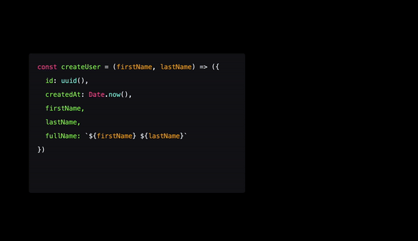

# Factory Pattern

With the factory pattern we can use factory functions in order to `create new object`s. A function is a factory function when it `returns a new object without the use of the new keyword`!

## Implementation

## Tradeoffs

🟢 `DRY` : The factory pattern is useful when we have to `create multiple objects that share the same properties`, without having to repeat the same code over and over. A factory function can easily return a custom object depending on the current environment, or user-specific configuration.

🔴 `Not really a pattern!` : In JavaScript, the factory pattern isn't much more than a function that returns an object without using the new keyword. ES6 `arrow functions` allow us to create small factory functions that implicitly return an object each time.