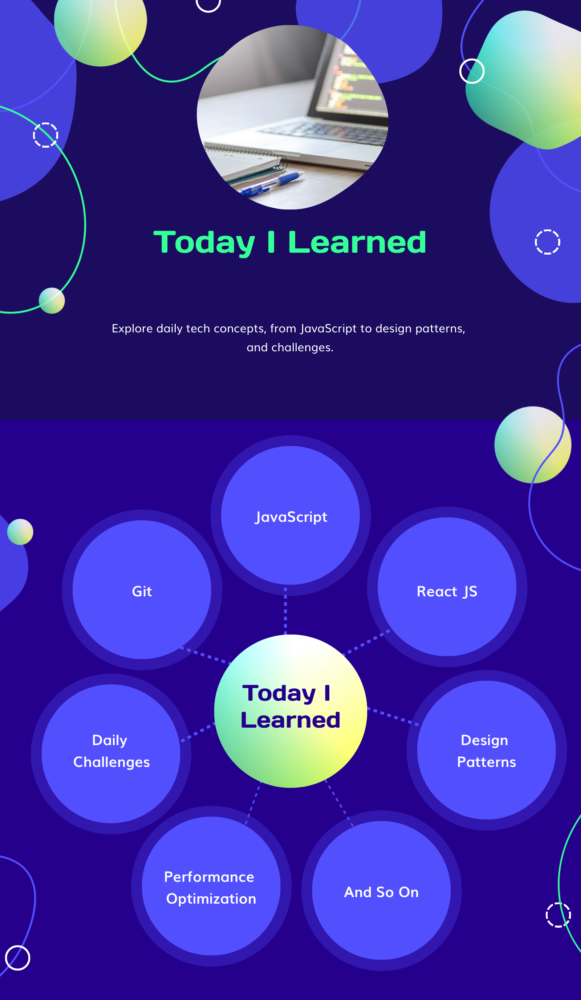
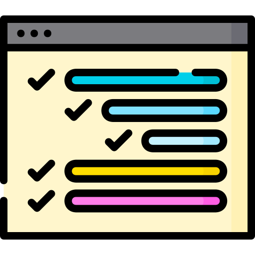

# Today I Learned

Welcome to my `"Today I Learned"` repository! Here, I document and share my `daily learnings` in various domains, ranging from `JavaScript` and `React` to `Design Patterns`, `Daily Coding Challenges`, `Git`, `Performance Optimization` and so on. This repository serves as a personal knowledge base and a resource for others who may benefit from the content.

### Happy learning and coding! 🚀

## Table of Contents 

- [JavaScript](#javascript)

## JavaScript 

- [JavaScript Design Patterns](JavaScript/Design-Patterns)

    - [All-in-One Overview](JavaScript/Design-Patterns/all-in-one.md)
    - [Module Pattern](JavaScript/Design-Patterns/module.md)
    - [Singleton Pattern](JavaScript/Design-Patterns/singleton.md)
    - [Proxy Pattern](JavaScript/Design-Patterns/proxy.md)
    - [Observer Pattern](JavaScript/Design-Patterns/observer.md)
    - [Factory Pattern](JavaScript/Design-Patterns/factory.md)
    - [Prototype Pattern](JavaScript/Design-Patterns/prototype.md)
    
